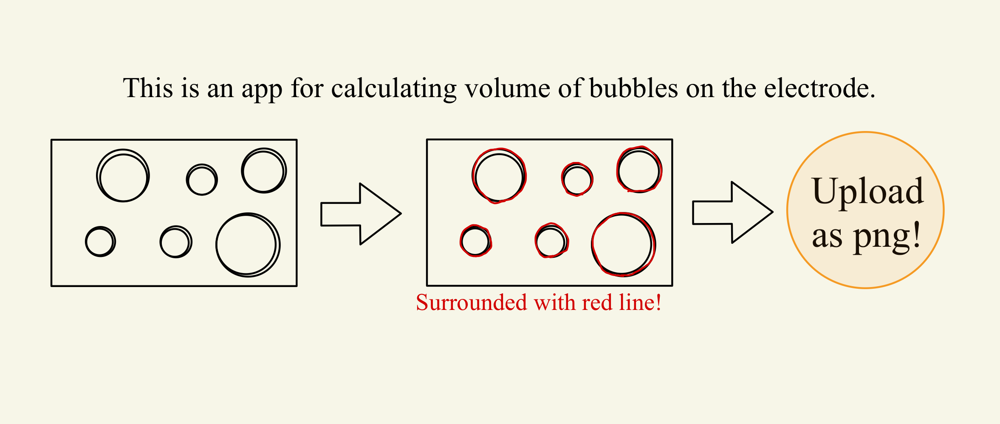

# bubble_app
This app allows for the automated detection of red circular objects in an image and outputs the necessary geometric data for further analysis.

## Link
https://bubble.trap.show/



## Method
This script processes an input image to detect red circular regions, approximates them as hemispheres, and calculates their volume. The following steps describe the methodology:

1. **Image Loading**: The image file path is provided as a command-line argument, and the image is loaded using OpenCV's `imread` function.
   - The width of the image is printed for reference.

2. **Grayscale Conversion**: The image is converted to grayscale to simplify processing.

3. **Red Color Detection**: A mask is created to detect red regions within a specified range of pixel values (from `lower_red` to `upper_red`).

4. **Contour Detection**: The contours of the red regions are detected using OpenCV's `findContours` function, which returns the external contours of the regions.

5. **Circle Approximation**: For each detected contour, if it contains enough points (minimum 5), the region is approximated as a circle using the `minEnclosingCircle` function.

6. **Volume Calculation**: The volume of each approximated circular region is calculated assuming it is a hemisphere, using the formula:

   ```math
   V = \frac{4}{3} \pi r^3
   ```

   where r is the radius of the circle.

8. **Annotated Image**: The script draws the detected circles and their radii on the output image. The radius and the corresponding circle number are displayed next to each detected region.

9. **Saving Results**:
   - The processed image, with annotated circles, is saved in the `processed_files` directory.
   - The radius and the center coordinates of each detected circle are normalized relative to the image width and saved in a CSV file. The CSV file is saved in the `circle_info` directory, with columns representing the circle number, normalized radius, and normalized center coordinates.
